# RevOps AI — Build Your AI Sales Team on Notion

> **Revenue Operations platform that lets marketing directors and company managers build, deploy, and manage an AI-powered sales team — with Notion as the single source of truth.**

Built for the [Notion MCP Challenge](https://dev.to/challenges/notion-2026-03-04).

[](https://youtu.be/nK-Te39bsS0) [](https://github.com/pooyagolchian/ai-sales-crm)

---

## The Problem

Marketing directors and sales managers face the same daily struggle:

1. **CRM tools are data silos** — Salesforce, HubSpot, Pipedrive lock your data behind proprietary walls. Your team already lives in Notion for docs, wikis, and project management. Why maintain two systems?
2. **No intelligent follow-up** — Reps forget to follow up, deals go stale, leads cool off. Nobody synthesizes activity history before a call.
3. **Manual pipeline analysis** — Managers waste hours building reports, scoring leads by gut feel, and writing repetitive emails.
4. **Sales martech is fragmented** — Lead scoring, email drafting, pipeline analytics, and activity tracking require 4+ separate tools.

## The Solution: RevOps AI

RevOps AI consolidates your entire revenue operation into a single platform where **Notion is your database** and **Gemini 2.5 Flash is your AI sales team member**. The AI doesn't just answer questions — it autonomously decides which Notion operations to perform, effectively becoming a self-directed sales agent.

### How It Works — Application Flow

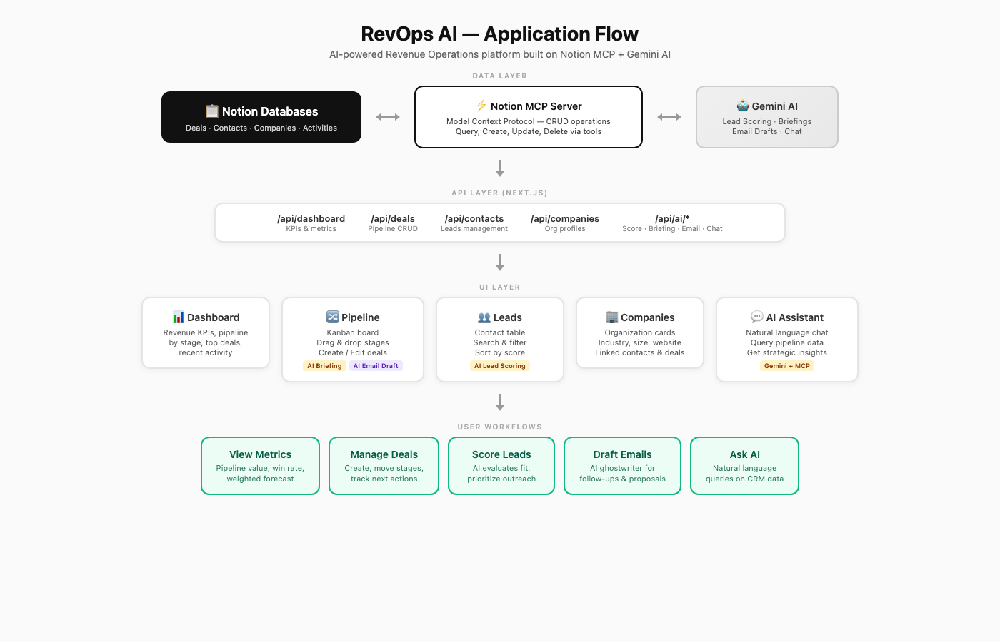

**The key innovation:** `mcpToTool()` from `@google/genai` auto-maps all 22 Notion MCP tools to Gemini function declarations. Gemini decides **at runtime** which tools to call — query a database, create a page, update a field, search across the workspace — without any hardcoded logic.

---

## Features

### Revenue Dashboard
Pipeline metrics at a glance: total pipeline value, win rate, deal breakdown by stage, top deals, and recent team activity. All data flows from Notion through MCP in real-time.

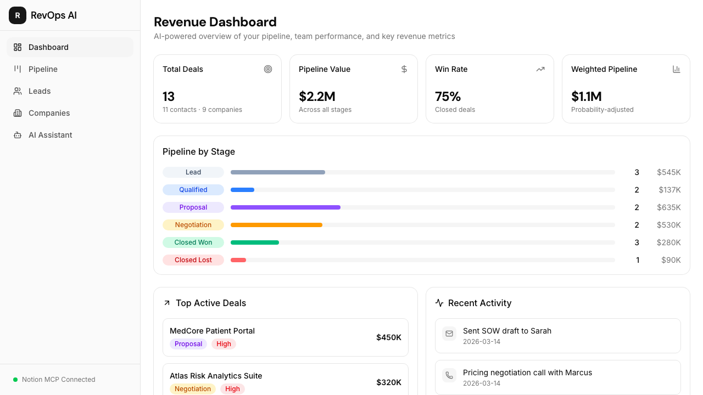

### Visual Deal Pipeline (Kanban)
Drag-and-drop deals between 6 stages (Lead → Qualified → Proposal → Negotiation → Closed Won → Closed Lost). Every move syncs to Notion instantly via MCP.

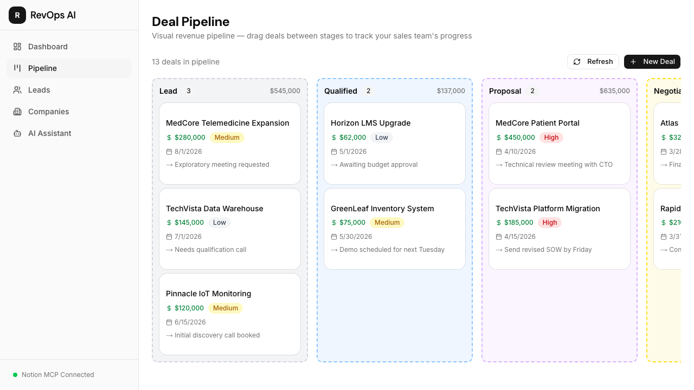

Click any deal to edit details, generate AI pre-call briefings, or draft sales emails:

| Deal Details | AI Email Draft |
|:---:|:---:|
| 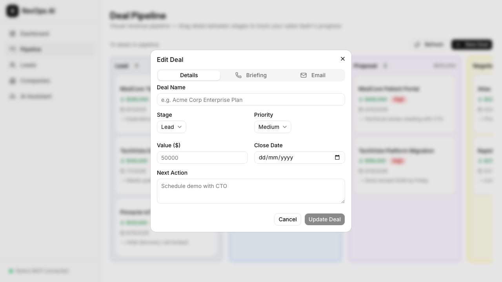 | 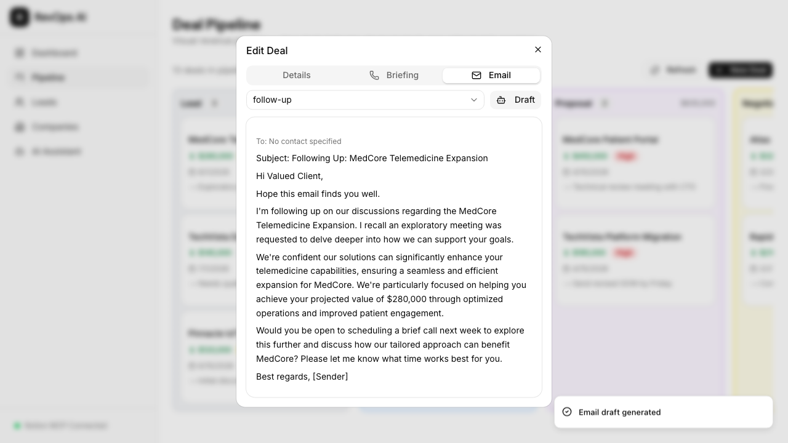 |

### AI Lead Scoring
One-click AI analysis evaluates a contact's profile (role seniority, company size, engagement history) and assigns a 0-100 score with written reasoning. Scores are persisted back to Notion for your team to see.

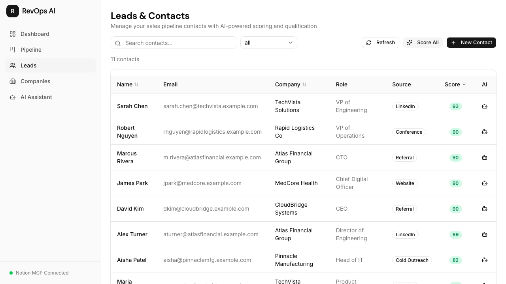

### Companies
Organization profiles linked to your contacts and deals — industry, size, website, and more.

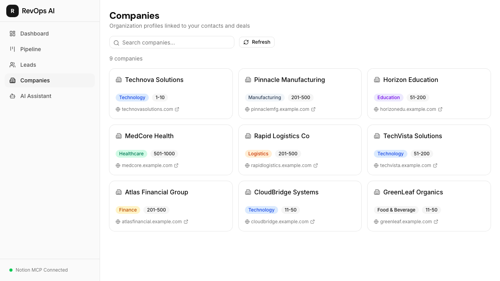

### AI Sales Team Manager
Chat with your revenue data using natural language. Ask *"What's my pipeline health?"* and the AI autonomously queries Notion, calculates win rates, and surfaces insights. Say *"Create a follow-up for the Acme deal"* and it creates activities linked to the right deal.

| Empty State | AI Response |
|:---:|:---:|
| 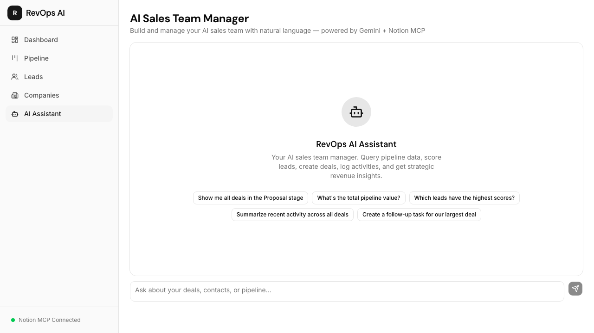 | 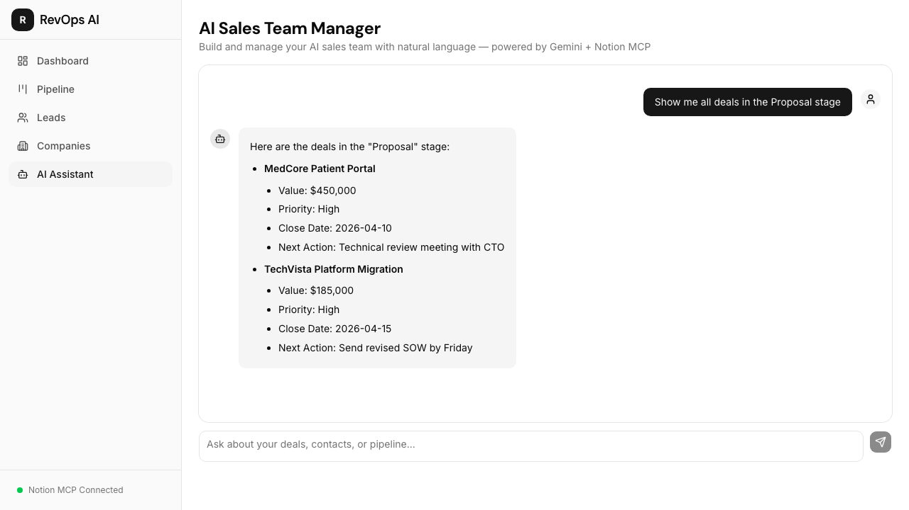 |

### Responsive Design
Fully responsive across desktop, tablet, and mobile — manage your pipeline from anywhere.

| Desktop | Tablet | Mobile |
|:---:|:---:|:---:|
|  | 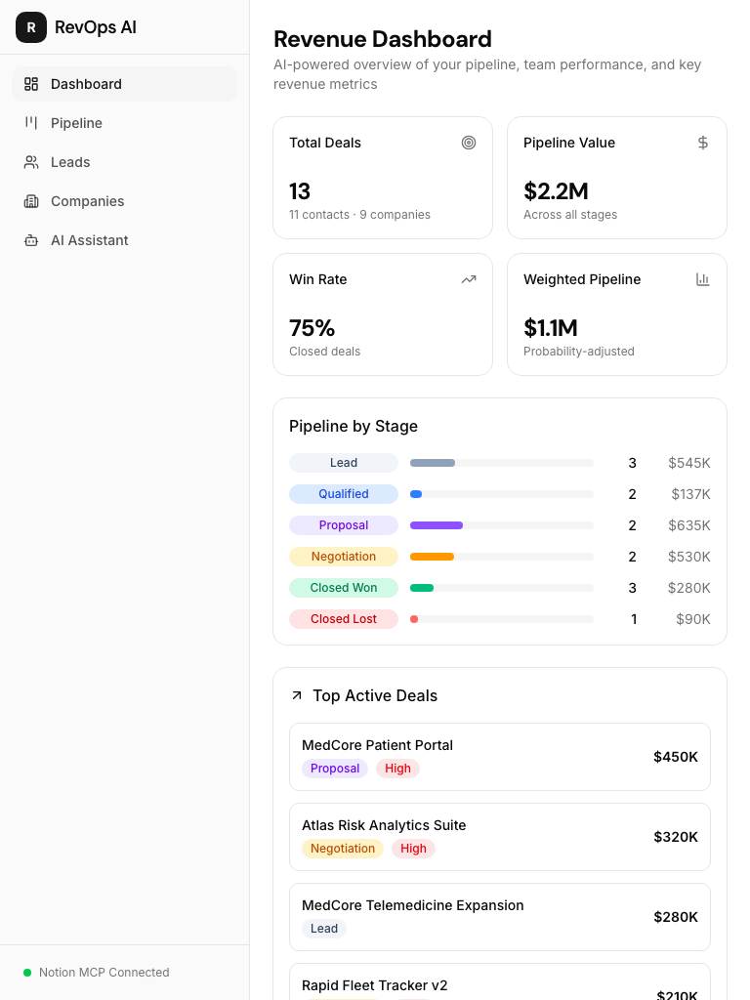 | 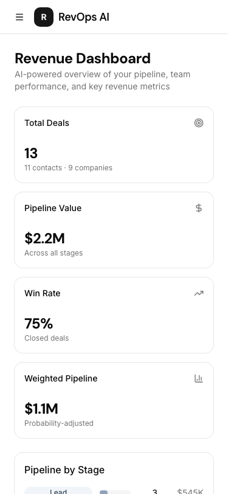 |

---

## Why Notion MCP? The Practical Benefits

Most CRM tools create data silos. RevOps AI takes a fundamentally different approach by using **Notion as the database layer through MCP**:

| Problem | Traditional CRM | RevOps AI + Notion MCP |
|---------|----------------|----------------------|
| **Data ownership** | Locked in proprietary DB | Your Notion workspace — you own it |
| **Team collaboration** | CRM-only views | Everyone can view/edit in Notion too |
| **Customization** | Pay for custom fields | Add any Notion property for free |
| **Integration** | Buy expensive connectors | Notion connects to 100+ tools natively |
| **AI access** | Limited to vendor's AI | Full autonomous AI via MCP protocol |
| **Migration** | Painful, lossy exports | Data stays in Notion forever |
| **Cost** | $50-150/user/month | Notion free/plus plan + free Gemini API |

### Why MCP Makes This Possible

The **Model Context Protocol** solves the AI-to-tool connection problem:

- **Standardized interface** — One protocol to expose all 22 Notion operations (search, query, create, update, retrieve...) as AI-callable tools
- **Autonomous tool selection** — Through `mcpToTool()`, Gemini receives the full tool catalog and decides which to call based on context. No hardcoded if/else chains.
- **Multi-step reasoning** — The AI chains multiple MCP calls in one response. Ask *"Brief me on TechCorp"* and it: (1) searches for the deal, (2) queries activities, (3) retrieves the contact, (4) synthesizes a briefing — autonomously.
- **Zero schema maintenance** — When Notion MCP adds new tools, they're automatically available to the AI. No code changes needed.

---

## Tech Stack

| Layer | Technology |
|-------|-----------|
| Framework | Next.js 15 (App Router), TypeScript (strict) |
| UI | Tailwind CSS v4, shadcn/ui, Lucide icons |
| AI | Google Gemini 2.5 Flash via `@google/genai` |
| Data | Notion (4 databases) via MCP protocol |
| MCP | `@notionhq/notion-mcp-server` (HTTP mode) + `@modelcontextprotocol/sdk` |
| DnD | `@dnd-kit/core` + `@dnd-kit/sortable` |
| Linting | Biome |

## Notion Databases

| Database | Purpose | Key Fields |
|----------|---------|-----------|
| **Contacts** | Lead & customer profiles | Name, Email, Company, Role, Lead Score, Source |
| **Deals** | Sales pipeline items | Name, Contact (relation), Stage, Value, Close Date, Priority, Next Action |
| **Activities** | Sales touchpoints | Type (call/email/meeting/note), Date, Deal (relation), Summary, Raw Notes |
| **Companies** | Organization profiles | Name, Industry, Size, Website |

---

## Getting Started

### Prerequisites

- Node.js 18+
- pnpm
- A [Notion Integration](https://developers.notion.com/) with access to your workspace
- A [Google Gemini API key](https://aistudio.google.com/apikey) (free tier works)

### Setup

1. Clone the repo:
   ```bash
   git clone https://github.com/pooyagolchian/ai-sales-crm.git
   cd ai-sales-crm
   pnpm install
   ```

2. Copy the environment file and fill in your keys:
   ```bash
   cp .env.example .env.local
   ```

3. Create 4 Notion databases (Contacts, Deals, Activities, Companies) in your workspace and add their IDs to `.env.local`.

4. Start both the Next.js dev server and the Notion MCP server:
   ```bash
   pnpm dev:all
   ```

5. Open [http://localhost:3000](http://localhost:3000).

### Environment Variables

```
GEMINI_API_KEY=           # Google Gemini API key (from aistudio.google.com)
NOTION_TOKEN=             # Notion integration token
MCP_SERVER_URL=           # MCP server URL (default: http://localhost:3001/mcp)
NOTION_CONTACTS_DB_ID=    # Contacts database ID
NOTION_DEALS_DB_ID=       # Deals database ID
NOTION_ACTIVITIES_DB_ID=  # Activities database ID
NOTION_COMPANIES_DB_ID=   # Companies database ID
NOTION_CONTACTS_DS_ID=    # Contacts data source ID
NOTION_DEALS_DS_ID=       # Deals data source ID
NOTION_ACTIVITIES_DS_ID=  # Activities data source ID
NOTION_COMPANIES_DS_ID=   # Companies data source ID
```

> **Note:** `DB_ID` (database IDs) are used for creating pages via `API-post-page`. `DS_ID` (data source IDs) are used for querying via `API-query-data-source`. These are different in Notion MCP v2+.

## Scripts

| Command | Description |
|---------|-------------|
| `pnpm dev` | Start Next.js dev server |
| `pnpm mcp` | Start Notion MCP server on port 3001 |
| `pnpm dev:all` | Start both concurrently |
| `pnpm build` | Production build |
| `pnpm lint` | Run Biome linter |

## License

MIT
